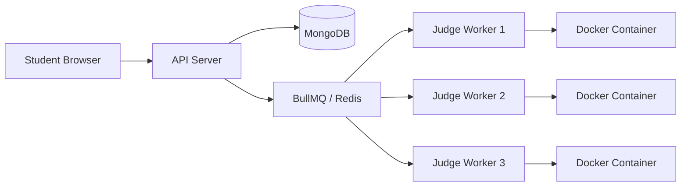

# CodeArena: Scalable Judge Infrastructure Plan
## High-Concurrency Execution Engine (200+ Concurrent Students)

This document outlines the architectural transition from our current "Local Mode" execution to a production-grade, distributed containerized judge engine.

---

## 1. System Architecture: Distributed Worker Pattern
To handle 200 simultaneous submissions without crashing the main web server, we must move to an **Asynchronous Worker Pattern**.

### Components:
1.  **API Gateway (Node.js)**: Receives the submission, saves it to MongoDB with a `Pending` status, and pushes a job into the queue.
2.  **Message Broker (Redis/BullMQ)**: Acts as a buffer. If 200 students submit at the exact same millisecond, the queue holds them and feeds them to workers as capacity allows.
3.  **Judge Workers (Python/Go/Node.js)**: Specialized nodes that do nothing but pull jobs from Redis and run them in Docker.
4.  **Shared Storage (NFS/S3)**: (Optional) If large datasets are needed for shell scripts.

---

## 2. Container Design & Isolation
Security is the top priority. Each student's code MUST run in a "Jail."

### A. Resource Constraints
For 200 students, we limit each container to ensure no one student can "starve" the system:
- **Memory**: 128MB - 256MB per container (`--memory="256m"`)
- **CPU**: 0.5 vCPU per container (`--cpus=".5"`)
- **PIDs**: Limit processes to 50 to prevent fork-bombs (`--pids-limit 50`)
- **Networking**: Disabled entirely to prevent data exfiltration (`--network none`)

### B. Language-Specific Images
Use "Distroless" or Alpine-based images to keep size small and execution fast:
- `codearena-gcc`: Pre-installed `gcc`/`g++`
- `codearena-java`: OpenJDK JRE
- `codearena-python`: Python 3.x slim
- `codearena-bash`: Minimalist Alpine with `bash`, `sed`, `awk`, `grep`.

---

## 3. DevOps & Scaling Strategy
How to ensure everything goes "smoothly" for 200 students:

### A. Worker Horizontal Scaling
*   **Auto-Scaling**: Use AWS Auto Scaling Groups or Kubernetes (K8s). If the Redis queue length > 50, spin up more Judge Workers automatically.
*   **Pre-Warming**: 10 minutes before a contest starts, the system should "pre-warm" a pool of workers to avoid cold-start delays.

### B. Docker Image Pooling
Pulling a Docker image takes seconds. We should have a **Docker Pool Manager** that keeps a few containers "paused" and ready to run, reducing the start time from 2s to 200ms.

### C. Monitoring & Observability
*   **Prometheus/Grafana**: Monitor CPU/RAM of the host machine.
*   **Health Checks**: If a Judge Worker hangs, the system should kill it and requeue the job.

---

## 4. Development Roadmap

### Phase 1: Queue Integration (Next Step)
- Install Redis.
- Refactor `backend/index.js` to use BullMQ.
- Move `executeShell` logic into a separate `worker.js` file.

### Phase 2: Docker Integration
- Replace `child_process.exec` with `dockerode` (Node.js Docker API).
- Create the standard `Dockerfile` for each language.

### Phase 3: Resource Hardening
- Implement cgroup limits.
- Add Time-Limit-Exceeded (TLE) and Memory-Limit-Exceeded (MLE) detection.

### Phase 4: Load Testing
- Use **JMeter** or **k6** to simulate 200 students hitting the `/submit` endpoint simultaneously.

---

## 5. Security Checklist
- [ ] No root access inside containers.
- [ ] Read-only root filesystem (`--read-only`).
- [ ] Temporary writable directory (`/tmp`) mounted as `tmpfs` (in RAM).
- [ ] Strict 2-5 second timeout for all code.
