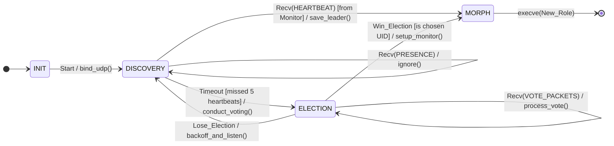
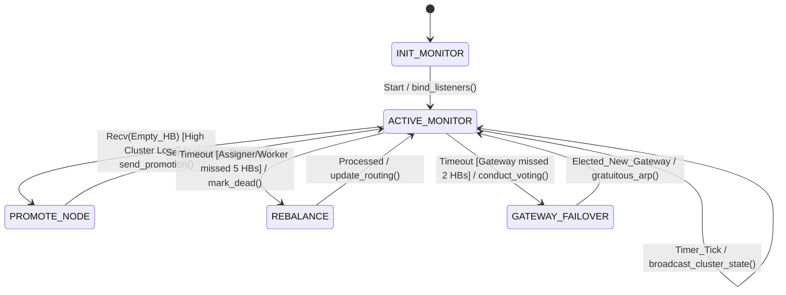
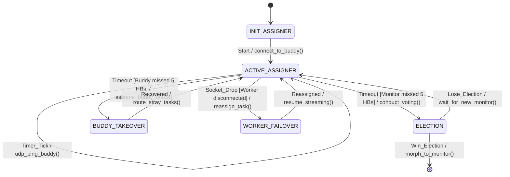
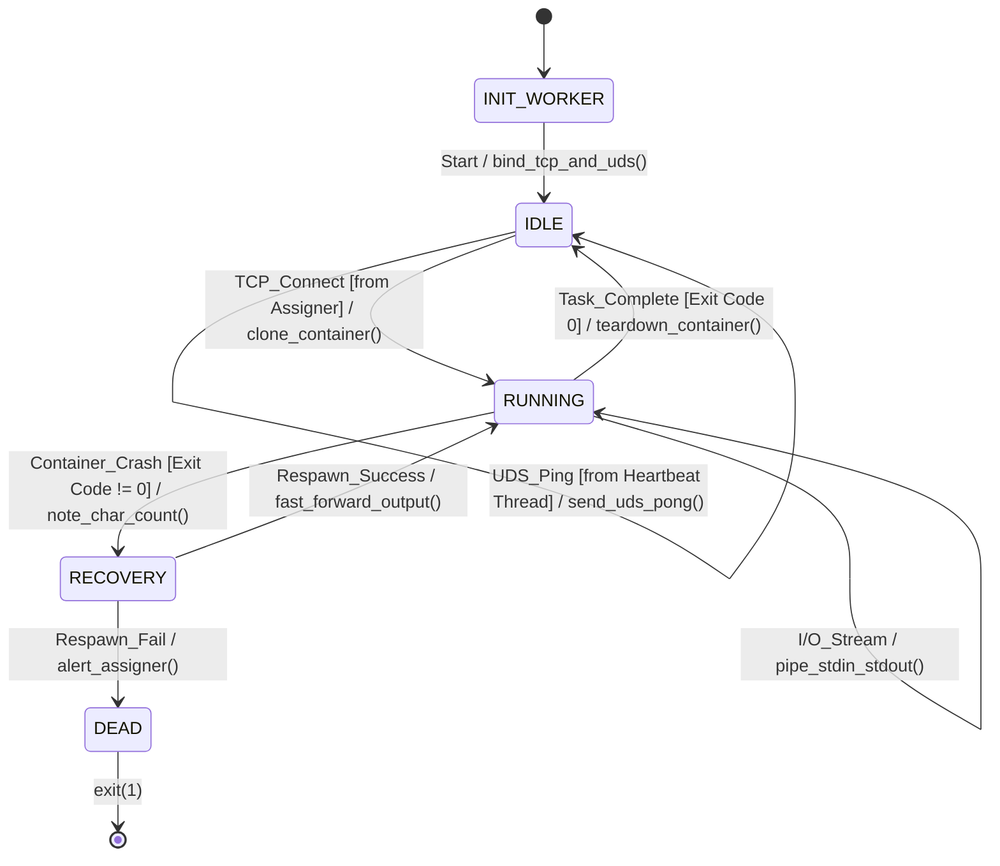

## Empty Node

```mermaid

stateDiagram-v2
    direction LR
    [*] --> INIT
    
    INIT --> DISCOVERY : Start / bind_udp()
    
    DISCOVERY --> DISCOVERY : Recv(PRESENCE) / ignore()
    DISCOVERY --> MORPH : Recv(HEARTBEAT) [from Monitor] / save_leader()
    DISCOVERY --> ELECTION : Timeout [missed 5 heartbeats] / conduct_voting()
    
    ELECTION --> ELECTION : Recv(VOTE_PACKETS) / process_vote()
    ELECTION --> MORPH : Win_Election [is chosen UID] / setup_monitor()
    ELECTION --> DISCOVERY : Lose_Election / backoff_and_listen()
    
    MORPH --> [*] : execve(New_Role)

```

## Monitor Node

```mermaid

stateDiagram-v2
    direction TB
    [*] --> INIT_MONITOR
    
    INIT_MONITOR --> ACTIVE_MONITOR : Start / bind_listeners()
    
    ACTIVE_MONITOR --> ACTIVE_MONITOR : Recv(Worker_HB) / update_PSI_table()
    ACTIVE_MONITOR --> ACTIVE_MONITOR : Recv(Assigner_HB) / update_load_table()
    ACTIVE_MONITOR --> ACTIVE_MONITOR : Timer_Tick / broadcast_cluster_state()
    
    ACTIVE_MONITOR --> PROMOTE_NODE : Recv(Empty_HB) [High Cluster Load] / send_promotion()
    PROMOTE_NODE --> ACTIVE_MONITOR : Sent / resume_listening()
    
    ACTIVE_MONITOR --> REBALANCE : Timeout [Assigner/Worker missed 5 HBs] / mark_dead()
    REBALANCE --> ACTIVE_MONITOR : Processed / update_routing()
    
    ACTIVE_MONITOR --> GATEWAY_FAILOVER : Timeout [Gateway missed 2 HBs] / conduct_voting()
    GATEWAY_FAILOVER --> ACTIVE_MONITOR : Elected_New_Gateway / gratuitous_arp()

```

## Assigner Node

```mermaid

stateDiagram-v2
    direction TB
    [*] --> INIT_ASSIGNER
    
    INIT_ASSIGNER --> ACTIVE_ASSIGNER : Start / connect_to_buddy()
    
    ACTIVE_ASSIGNER --> ACTIVE_ASSIGNER : Recv(Monitor_State) / update_worker_scores()
    ACTIVE_ASSIGNER --> ACTIVE_ASSIGNER : Recv(TCP_Task) / select_worker() & pipe_io()
    ACTIVE_ASSIGNER --> ACTIVE_ASSIGNER : Timer_Tick / udp_ping_buddy()
    
    ACTIVE_ASSIGNER --> ELECTION : Timeout [Monitor missed 5 HBs] / conduct_voting()
    ELECTION --> ACTIVE_ASSIGNER : Lose_Election / wait_for_new_monitor()
    ELECTION --> [*] : Win_Election / morph_to_monitor()
    
    ACTIVE_ASSIGNER --> BUDDY_TAKEOVER : Timeout [Buddy missed 5 HBs] / assume_buddy_tasks()
    BUDDY_TAKEOVER --> ACTIVE_ASSIGNER : Recovered / route_stray_tasks()
    
    ACTIVE_ASSIGNER --> WORKER_FAILOVER : Socket_Drop [Worker disconnected] / reassign_task()
    WORKER_FAILOVER --> ACTIVE_ASSIGNER : Reassigned / resume_streaming()

```

## Worker Node

```mermaid

stateDiagram-v2
    direction TB
    [*] --> INIT_WORKER
    
    INIT_WORKER --> IDLE : Start / bind_tcp_and_uds()
    
    IDLE --> IDLE : UDS_Ping [from Heartbeat Thread] / send_uds_pong()
    IDLE --> RUNNING : TCP_Connect [from Assigner] / clone_container()
    
    RUNNING --> RUNNING : I/O_Stream / pipe_stdin_stdout()
    
    RUNNING --> IDLE : Task_Complete [Exit Code 0] / teardown_container()
    RUNNING --> RECOVERY : Container_Crash [Exit Code != 0] / note_char_count()
    
    RECOVERY --> RUNNING : Respawn_Success / fast_forward_output()
    RECOVERY --> DEAD : Respawn_Fail / alert_assigner()
    
    DEAD --> [*] : exit(1)

```
